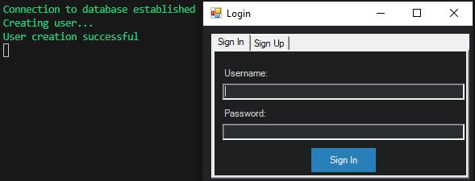

# Password-Manager

## Übersicht

Der Passwort Manager ist ein Schulprojekt für das Modul 122. Dieses PowerShell Skript erlaubt dem Benutzer ihr Passwort sicher und einfach zu speichern. Die Einträge werden in einer SQlite Datenbank gespeichert, die lokal auf dem Gerät ist.

## Ziel dieses Skripts

Das Ziel dieses Projektes ist ein Benutzerfreundlicher Passwort-Manager zu erstellen mit PowerShell.
Die Benutzeroberfläche wird eifach zum handhaben sein.
Die gespeicherten Passwörter werden verschlüsselt in einer SQlite Datenbank gespeichert, die wir erstellen werden.
Man kann die Passwörter abrufen, bearbeiten oder löschen.

**S - Specific (Spezifisch)**:

Das Ziel ist ein Passwort-Manager zu erstellen, der eine SQlite Datenbank für die Einträge braucht. In dieses Skript kann man seine Passwörter verschlüsselt speichern, bearbeiten oder löschen. Zu den gespeicherten Passwörter, kann man den Usernamen, eine Email-Adresse, Notizen und Tags speichern. Dieses Skript wird mit einer Benutzeroberfläche erstellt, um eine einfache Benutzung zu gewährleisten. Um den Password-Manager zu brauchen, muss man ein Hauptpasswort setzen, damit die gespeicherten Einträge nicht offen für alle sind.

**M - Measurable (Messbar)**:

Dieses Skript kann man anhand der Benutzung messen. Zudem ist erkennbar, wie dieses Skript mit dem aufrufen editieren oder löschen der Einträge umgeht. Auch die Aktionen, wie die Informationen zusätzlich der Passwörter sind messbar. Die Benutzeroberfläche muss einfach zum navigieren sein und die Passwörter schnell abrufbar sein.

**A - Achievable (Erreichbar)**:

Dieses Ziel ist realistisch zum Umsetzen. Hier geht es um den Umfang, den man ausführt für dieses Projekt. Mit den Implementationen der Verschlüsselung, eintragen, editieren, abrufen und löschen der Passwörter, erreichen wir alle Kriterien, die es braucht einen guten Passwort-Manager zu erstellen.  

**R - Relevant (Relevant)**:

Dieses Projekt hat eine grosse Relevanz, weil man seine Passwörter sicher und einfach speichern möchte. Dazu werden auch zusätzliche Funktioinen zur Verfügung gestellt, die das benutzen des Passwort-Manager einfacher macht. Dieses Skript strebt eine effektive und einfache Weise an Passwörter zu speichern, in welcher auch die Sicherheit gewährleistet wird. 

**T - Time-bound (Zeitgebunden)**:

Die Zeitspanne, die wir haben sind 8 Wochen. In diesen 8 Wochen, wollen wir die Arbeit gemäss den Kriterien erarbeiten und fertigstellen. Die verschiedenen Schritte, wie Planung, Entwicklung und Testen des Skripts werden in diesen 8 Wochen erfolgen. Ein Erfolg wäre, wenn man vor dem geplanten Zeitplan, die Arbeit fertig bekommt. damit könnte man auch Finale optimierungen treffen. 

## Bevor man startet

1. Installiere SQlite https://www.sqlite.org/download.html

2. Erstelle einen neuen Ordner C:\sqlite

3. Extrahiere die Dateien und verschiebe sie in den erstellten Ordner

4. Öffne die Eingabeaufforderung (CMD)

5. Navigiere zu C:\sqlite

6. Wenn du in Ordner bist gib "sqlite3" ein

## Erste Schritte

1. **Klone die repo**:

```bash
$ git clone git@github.com:parwarr/password-manager.git
```

2. **Navigiere zum Ordner**:

```bash
$ cd ...
```

## Um den Passwort-Manager zu starten, befolge diese Schritte:

1. **Ändere den DB Pfad im Skript:** 

Sobald du die Repository geklont hast, musst du in Zeile 24 den Pfad anpassen, wo die Datei "password-manager.db" gespeichert ist

2. **Füre das Skript aus:**

Füre das Skript mit PowerShell aus

## Projekt Details

### Skript Übersicht

The script consists of several functions and steps:

1. **Datenbankinitialisierung**:
Importiert das PSSQLite-Modul für die Interaktion mit der SQLite-Datenbank.

Setzt den Pfad für die SQLite-Datenbank.

2. **Globale Variablen**
Definiert eine globale Variable $global:loggedInUserId, um die Benutzer-ID nach erfolgreichem Login zu speichern.

3. **User Functions**:

**CreateDatabaseConnection**:
Prüft und stellt eine Verbindung zur SQLite-Datenbank her.

**CreateLogin**:
Neues Login erstellen.

**Login**:
Validiert Benutzeranmeldeinformationen und meldet sich an.

**AddEntry**:
Fügt einen neuen Eintrag mit Details wie Titel, E-Mail, Benutzername, Passwort, Notizen, URL und Tags hinzu.

4. **GUI Elemente**:

**ShowLoginGui**:
Zeigt eine grafische Benutzeroberfläche für Benutzeranmeldung und -registrierung an.

Ermöglicht Benutzern das Umschalten zwischen Anmeldung und Registrierung.

Ruft die Funktion Login oder CreateLogin basierend auf der Benutzereingabe auf.

**ViewNotes**:
Zeigt eine GUI zum Anzeigen und Löschen von Einträgen, organisiert durch Registerkarten, an.

Ermöglicht Benutzern das Löschen von Einträgen durch Eingabe der ID.

**ShowPasswordManagerGui**:
Zeigt die Haupt-GUI des Passwort-Managers an.

Ermöglicht Benutzern das Hinzufügen neuer Einträge, Anzeigen und Löschen vorhandener Einträge sowie das Abmelden.

5. **Hauptausführung**:
Initialisiert die Datenbankverbindung mit CreateDatabaseConnection.

Zeigt die Anmeldungs-GUI mit ShowLoginGui an.

6. **Fehlerbehandlungg**:
Fangt Ausnahmen ab und gibt Fehlermeldungen aus.

7. **Ablauf**:
Benutzer führen das Skript aus und initialisieren die Datenbankverbindung.

Das Skript fordert die Benutzer mit einer Anmeldungs-GUI auf.

Benutzer können sich anmelden oder registrieren.

Nach erfolgreichem Login wird die Haupt-GUI des Passwort-Managers angezeigt.

Benutzer können neue Einträge hinzufügen, vorhandene Einträge anzeigen und löschen sowie sich abmelden.

- **TODO**: 

[] Brainstorm Projekt //Saranhan, Parwar

[] Planen der Schritte //Saranhan, Parwar

[] Repository erstellen in GitHub //Parwar

[] ReadMe.md schreiben // Saranhan

[] Header erstellen für das Skript //Saranhan

[] Datenbank erstellen //Parwar

[] Datenbank Verbindung herstellen //Parwar

[] Login Funktion erstellen für den Passwort-Manager //Parwar

[] Eintragfunktion erstellen für Passwörter //Parwar

[] Login GUI erstellen mit Sign In und Sign Up //Parwar

[] Passwort-Manager GUI erstellen mit Einträge erstellen, View Notes und Logout knöpfen //Parwar

[] View Notes GUI Tab erstellen, wo man die Einträge editieren oder löschen kann //Parwar

[] Test- und Usecase erstellen //Saranhan

[] Skript Aufbau schön machen


### Autor

- sth134864@stud.gibb.ch
- hpa134085@stud.gibb.ch

## Voraussetzungen

- PowerShell
- SQlite

## Disclamer

- This password manager will store your passwords only locally on the database. This password manager utilises as an convenience application and not as an backup solution.

## Usecase

**Testfall 1: Neuen Benutzer erstellen** 

**Usecase:** Ein neuer Benutzer möchte sich im Passwort-Manager registrieren. 

**Testszenario:**

Benutzer gibt einen eindeutigen Benutzernamen und ein sicheres Passwort ein. 

**Schritte:** 

Skript starten mit PowerShell 

User registrieren 

**Randbedingungen:** 

Skript muss lokal von GitHub geklont sein. 

Im Skript den Datenbank Pfad angepasst haben.

**Erwartete Ergebnisse:** 

Das Skript sollte den neuen Benutzer erfolgreich erstellen und eine Bestätigung ausgeben. 

**Beweis der Durchführung:**





**Testfall 2: Benutzeranmeldung**

**Usecase:** Ein Benutzer möchte sich im Passwort-Manager anmelden. 

**Testszenario:** 

Benutzer gibt gültigen Benutzernamen und gültiges Passwort ein. 

**Schritte:** 

Skript starten 

Einloggen mit einem erstellen User 

**Randbedingungen:** 

Skript muss lokal von GitHub geklont sein. 

Im Skript den Datenbank Pfad angepasst haben. 

User registriert haben

**Erwartete Ergebnisse:** 

Das Skript sollte den Benutzer erfolgreich anmelden und eine Bestätigung ausgeben. 

**Beweis der Durchführung:** 


**Testfall 3: Neuen Eintrag hinzufügen** 

**Usecase:** Ein eingeloggter Benutzer möchte einen neuen Eintrag (Passwort) hinzufügen. 

**Testszenario:** 

Benutzer gibt alle erforderlichen Informationen für den neuen Eintrag ein. 

**Schritte:**

Skript starten mit PowerShell 

Mit einem existierenden User anmelden 

Eintrag erstellen 

**Randbedingungen:** 

Skript muss lokal von GitHub geklont sein.  

Im Skript den Datenbank Pfad angepasst haben.  

User registriert haben 

**Erwartete Ergebnisse:** 

Das Skript sollte den Eintrag erfolgreich hinzufügen und eine Bestätigung ausgeben. 

**Beweis der Durchführung:** 


